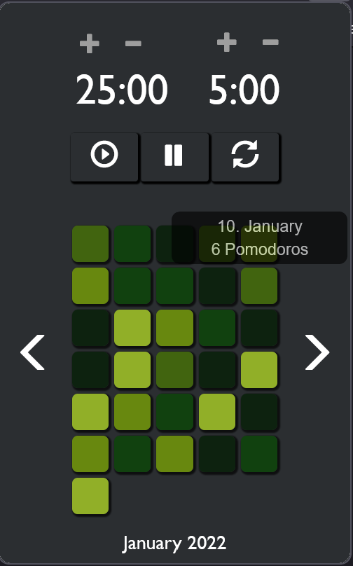

# pomodoro firefox addon to track daily pomodoro times

Stores pomodoros completed in local firefox storage and 
displays history in a github inspired style.
Uses only local storage to date, so history will be lost if
local storage is deleted!

A super simple layout with pure javascript/html/css ist implemented.
On the top left is the pomodoro time which can be changed via the 
<b>+</b> and <b>-</b> buttons. 
On the right is the rest time in between pomodoros, which is also
changed via the corresponding <b>+</b> and <b>-</b> buttons.

When the pomodoro time is over, the addon icon 
will turn red and start to rotate  

